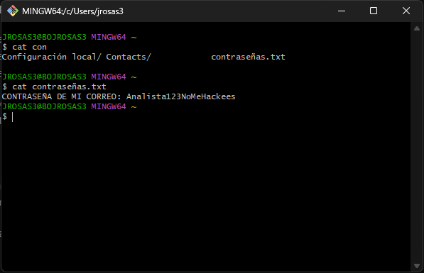

= Introducción basica a Git

== ¿Que es Git y para que sirve?

Git es una herramienta de control de verciones diseñada para ayudar a las personas a llevar el control de los cambios realizados en archivos y proyectos. Aunque hoy en dia es muy usado en el desarrollo de sofware, tambien puede utilizarse para documentos, scripts, configuraciones y muchos otros tipos de archivos.

Imagina que estas trabajando en un proyecto importante y decides hacer varios cambios. Despues de algunas horas te das cuenta de que algo dejo de funcionar correctamente y no recuerdas exactamente que modificaste. Sin una herramienta de control de verciones seria muy dificil volver atras o recuperar una vercion estable del trabajo.

Git soluciona este problema permitiendo guardar “fotografias” del proyecto en diferentes momentos. Cada una de estas fotografias recibe el nombre de commit. Gracias a esto es posible revisar cambios anteriores, comparar archivos y recuperar informacion perdida facilmente.

Otra caracteristica importante de Git es el manejo de ramas. Las ramas permiten crear espacios separados donde una persona puede probar ideas nuevas o realizar cambios sin afectar la vercion principal del proyecto. Cuando los cambios funcionan correctamente, pueden integrarse nuevamente.

Actualmente Git es una herramienta fundamental en equipos de trabajo porque permite que varias personas colaboren al mismo tiempo sobre un mismo proyecto..

.Apariencia de Git
[#apariencia-git]

== Beneficios y ventajas de utilizar Git

Uno de los mayores beneficios de Git es la seguridad que ofrece al momento de trabajar sobre archivos importantes. Cada cambio queda registrado, por lo que es posible saber quien realizo una modificacion, cuando la hizo y que fue exactamente lo que cambio.

Git tambien ayuda a evitar la perdida de informacion. Muchas personas acostumbran guardar archivos con nombres como:

* informe_final.docx
* informe_final_v2.docx
* informe_final_ahora_si.docx
* informe_final_definitivo.docx

Este tipo de practicas generan desorden y confusion. Con Git no es necesario crear multiples copias manuales porque el sistema guarda automaticamente el historial de cambios.

Otra ventaja importante es la colaboracion en equipo. Varias personas pueden trabajar simultaneamente sobre diferentes partes del proyecto. Posteriormente Git permite unir esos cambios y resolver conflictos en caso de que dos personas hayan modificado el mismo archivo.

Git tambien facilita la experimentacion. Por ejemplo, un desarrollador puede crear una rama para probar una nueva funcionalidad sin arriesgar el funcionamiento del proyecto principal. Si los resultados no son buenos, simplemente puede eliminar la rama y continuar trabajando normalmente.

Ademas, Git se integra facilmente con plataformas como GitHub, GitLab y Azure DevOps, las cuales permiten almacenar repositorios en la nube y compartirlos con otros usuarios.

Finalmente, aprender Git no solo mejora la organizacion del trabajo, sino que tambien es una habilidad muy valorada en ambientes profecionales relacionados con tecnologia y desarrollo de sofware..